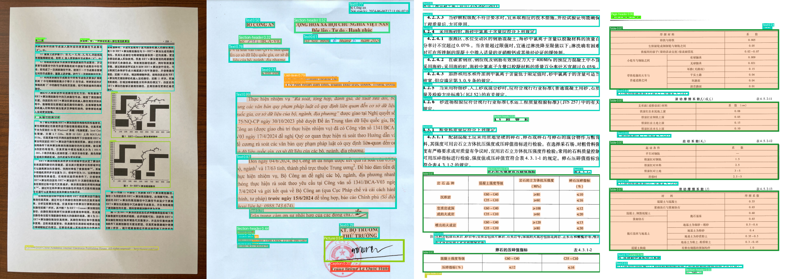
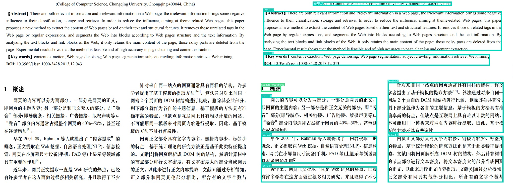
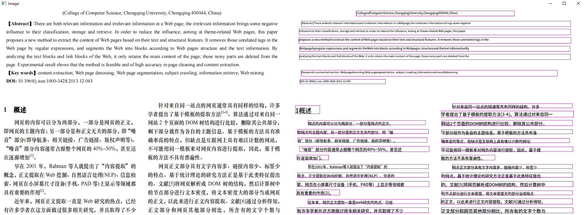
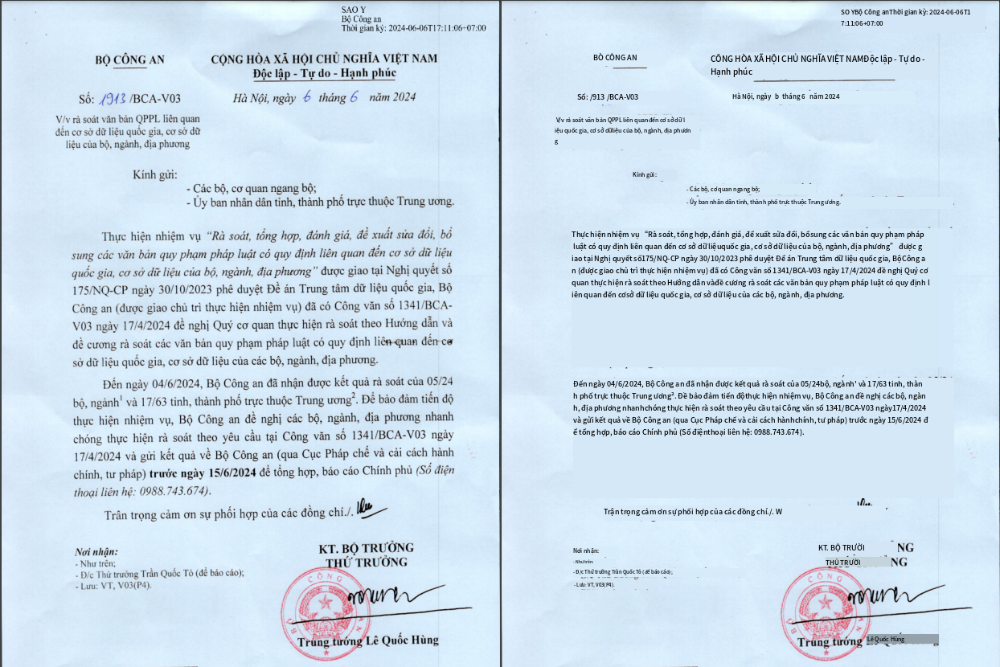
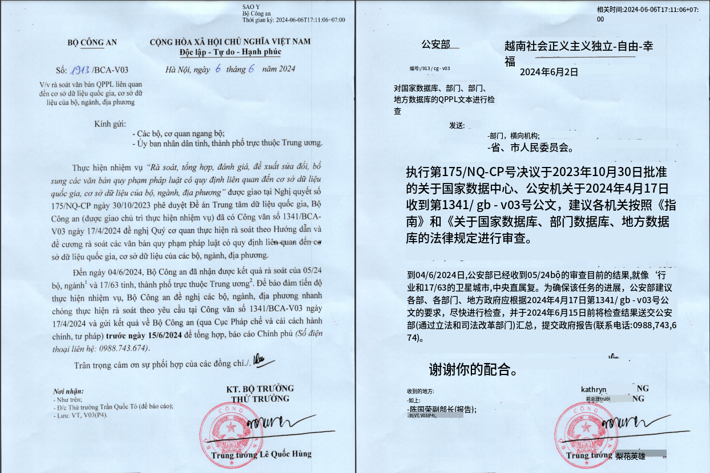

之前在我的[**bolg**](<https://cyanscope.com/>)记录过**间隙·树·排序算法**（项目地址：<https://github.com/hiroi-sora/GapTree_Sort_Algorithm>）以及其更改过的可视化过程。但是由于算法本身是对纯文本块进行排序，当遇到较为复杂的图像结构时，由于缺少原始图像信息，存在丢失图片类型数据、无法理解表格等问题。

此算法的跟进版目标在于对排序算法的后续操作提供更为精确的版面恢复，故名称沿用自间隙·树·排序算法，命名**间隙·树·交并比（IoU）聚类算法**，以下简称GTIoUC。算法的最终目的与传统OCR或版面恢复不同，旨在将OCR结果在版面分析结果中聚合成包含完整语义的段落，为翻译提供服务。

<font color='gold'>**GTIoUC包含的算法：**</font>

<font color='gold'>❶</font> **GapTree提供的文本块排序算法；**

<font color='gold'>❷</font> **基于YOLO的版面分析算法；**

<font color='gold'>❸</font> **OCR box和YOLO layoutbox之间的交并比聚类算法**

<font color='gold'>**GTIoUC解决的问题：**</font>

<font color='gold'>❶</font> **仅仅版面分析的效果不够精确；**

<font color='gold'>❷</font> **版面分析后内容总是存在缺失；**

<font color='gold'>❸</font> **版面分析获得图像结构后往往不再OCR图像中文字；**

<font color='gold'>❹</font> **OCR结果按行返回，无段落结构，上下文语义存在缺失；**

# <font color='#0099ee'>GapTreeIoU_Cluster_Algorithm | 间隙·树·交并比聚类算法</font>



**GTIoUC算法的特殊之处：**

<font color='gold'>❶</font> **PPStructure等版面分析算法需要根据版面分析结果做N次截取片段OCR，但是传入OCR模型的`det_limit_side_len`参数总是固定的，导致OCR经常提取不到相应结果，产生空白页。算法模型层面每轮仅做1次完整的全文OCR和1次Layout，解决OCR空白页的同时一定程度上优化了时间复杂度；**

<font color='gold'>❷</font> **算法的版面分析模型由YOLOV11结合DocLayNet数据集训练得到，精度较早期模型具有较大提升，适用于复杂文档，泛化能力高的同时兼顾了多语种识别；**

<font color='gold'>❸</font> **尽管如此，目前任何版面恢复模型仍旧不具备100%捕获文档信息的能力。此时由于算法的OCR部分和Layout部分是相对独立进行的，最终OCR和Layout的结果将进行IoU聚类，IoU过程中先前Layout缺失的信息将被OCR结果补充、得到段落完整语义，极大程度上提高了版面恢复的准确度。**

下面将详细介绍GTIoUC的版面恢复流程。

## 使用方式

### 创建虚拟环境

```shell
conda create -n py39_gtiouc python=3.9
conda activate py39_gtiouc
```

### 安装依赖：

```shell
pip install -r requirements.txt -i https://pypi.tuna.tsinghua.edu.cn/simple
```

### 安装模型

模型下载地址：<https://huggingface.co/elbadaernU/hg_doclaynet_yolo_imgsz1120/tree/main>

| model   | name                                                         |
| ------- | ------------------------------------------------------------ |
| yolo11n | [**hg_doclaynet_yolo11n_imgsz1120.pt**](<https://huggingface.co/elbadaernU/hg_doclaynet_yolo_imgsz1120/blob/main/hg_doclaynet_yolo11n_imgsz1120.pt>) |
| yolo11x | [**hg_doclaynet_yolo11x_imgsz1120.pt**](<https://huggingface.co/elbadaernU/hg_doclaynet_yolo_imgsz1120/blob/main/hg_doclaynet_yolo11x_imgsz1120.pt>) |

下载后将模型放入`models`文件夹，再去main.py中修改模型（默认使用yolo11x模型）：

```python
model = YOLO(os.path.join(PR, "models/hg_doclaynet_yolo11x_imgsz1120.pt"))
```

### 执行`main.py`脚本

在`__main__`脚本中添加自己的OCR api地址。如果暂无api接口可以使用内置的文件进行测试，目前仅支持`10.png`。

```shell
python main.py
```

输出结果位于路径`./output`下

## 算法流程

### 1.Layout

#### 数据集

DocLayNet（<https://github.com/DS4SD/DocLayNet>），选择`Doclaynet core dataset`数据集下载


数据集共包括十种常见的文档板块类型：

- **Captain**：大标题
- **Footnote**：脚注
- **Formula**：公式
- **List-item**：表格/列表项
- **Page-footer**：页脚
- **Page-header**：页眉
- **Picture**：图像
- **Section-header**：章节标题
- **Table**：表格
- **Title**：小标题

#### yaml

数据集已是yolo格式，不需要进行转换。补充yaml文件`layout.yaml`：

```yaml
path: {fullpath}/doclaynet
train: train.txt
val: val.txt
test: val.txt

names:
  0: Caption
  1: Footnote
  2: Formula
  3: List-item
  4: Page-footer
  5: Page-header
  6: Picture
  7: Section-header
  8: Table
  9: Text
  10: Title

```

#### 训练

需要安装最新`ultralytics`（yolo11），根据显存大小调整batch_size。这里使用的GPU环境：RTX3090 24G*2；batch_size设置为8时，显存占用13Gbi/卡；使用的yolo预训练模型：yolo11x.pt。

```python
from ultralytics import YOLO

# Load a model
model = YOLO('/exp/work/translate_plat/yolov11/yolo11x.pt')

# Train the model with 2 GPUs
model.train(
    data='layout.yaml',
    batch=8,
    imgsz=1120,
    epochs=500,
    lr0=0.02,
    optimizer='SGD',
    device=[0, 1])
model.val()
```

训练过程中每个epoch约1小时，训练时间过长，不定性因素较多。当训练中止后可更换训练脚本：

```python
from ultralytics import YOLO

# Load a model
model = YOLO('/exp/work/translate_plat/yolov11/runs/detect/train/weights/best.pt')

# Train the model with 2 GPUs
model.train(
    data='layout.yaml',
    batch=8,
    imgsz=1120,
    epochs=500,
    lr0=0.02,
    resume=True,
    optimizer='SGD',
    device=[0, 1])
model.val()
```

约500小时（3周）以后得到最终Layout模型。获取版面分析结果：

```python
det_res = model.predict(
    image,
    iou=0.1,
    imgsz=1024,
    conf=0.5,
    device="cuda:1",
    save=False,
)
```



### 2.OCR

OCR作为一切的基石，选择常用的即可，仅需要对OCR的结果做一层数据结构的标准化。

这里推荐使用两款OCR：PaddleOCR和SuryaOCR，前者较为常用，对中英文方便开箱使用。后者中文效果较差，但是多语种效果几乎碾压PaddleOCR。

以PaddleOCR为例：



OCR接口返回结果示例如下：

```
[[[[[225.0, 9.0], [782.0, 9.0], [782.0, 27.0], [225.0, 27.0]], ['(CollegeofComputerScience,ChongqingUniversity,Chongqing400044,China)', 0.9394824504852295]], [[[32.0, 45.0], [981.0, 46.0], [981.0, 65.0], [32.0, 64.0]], ['[Abstract]There areboth relevant informationand irrelevant information in a Webpage,the irrelevant information brings some negative', 0.9342334866523743]], [[[24.0, 73.0], [981.0, 76.0], [981.0, 94.0], [24.0, 92.0]], ['influence to their classification, storage and retrieve.In order to reduce the influence, aiming at theme-related Web pages, this paper', 0.9241952300071716]], [[[23.0, 103.0], [982.0, 102.0], [982.0, 124.0], [23.0, 125.0]], ['proposes a new method to extract the content of Web pages based on their text and structural features. It removes those unrelated tags in the', 0.947555661201477]], [[[26.0, 134.0], [979.0, 134.0], [979.0, 152.0], [26.0, 152.0]], ['Webpagebyregular expressions,and segments theWeb into blocks according to Webpages structureand thetext informationBy', 0.9187150597572327]], [[[25.0, 162.0], [980.0, 162.0], [980.0, 181.0], [25.0, 181.0]], ['analyzing the text blocks and link blocks of the Web, it only retains the main content of the page; those noisy parts are deleted from the', 0.9074915051460266]], [[[31.0, 219.0], [934.0, 222.0], [934.0, 240.0], [31.0, 238.0]], ['[Keywords] contentextraction; Webpagedenoising;Web pagesegmentation, subject crawling,informationretrieve;Webmining', 0.9111730456352234]], [[[27.0, 251.0], [328.0, 251.0], [328.0, 267.0], [27.0, 267.0]], ['DOl:10.3969/j.issn.1000-3428.2013.12.043', 0.9246572256088257]], [[[11.0, 344.0], [98.0, 347.0], [97.0, 373.0], [11.0, 370.0]], ['1概述', 0.9476785063743591]], [[[564.0, 337.0], [987.0, 337.0], [987.0, 352.0], [564.0, 352.0]], ['针对来自同一站点的网通常具有同样的结构，许多', 0.9185552597045898]], [[[525.0, 363.0], [991.0, 363.0], [991.0, 385.0], [525.0, 385.0]], ['学者提出了基于模板的提取方法[3-4]。算法通过对来自同一', 0.9745544195175171]], [[[56.0, 397.0], [469.0, 397.0], [469.0, 412.0], [56.0, 412.0]], ['网贞的内容可以分为两部分，一部分是网贞的正文，', 0.8542546033859253]], [[[526.0, 396.0], [987.0, 396.0], [987.0, 415.0], [526.0, 415.0]], ['网站2个页面的DOM树结构进行比较，删除其公共部分，', 0.977752149105072]], [[[18.0, 428.0], [480.0, 428.0], [480.0, 443.0], [18.0, 443.0]], ['即网贞的主题内容；另一部分是和正文无关的部分，即“噪', 0.9320459961891174]], [[[526.0, 429.0], [988.0, 429.0], [988.0, 444.0], [526.0, 444.0]], ['下部分就作为各自的主题信息。基于模板的方法具有准', 0.9174962043762207]], [[[19.0, 458.0], [475.0, 458.0], [475.0, 474.0], [19.0, 474.0]], ['音”部分（即导航条、相关链接、广告链接、版权声明等）。', 0.9373550415039062]], [[[526.0, 460.0], [977.0, 460.0], [977.0, 475.0], [526.0, 475.0]], ['确率高的等点，但缺点是互联网上具有难以计数的网站：', 0.9136723279953003]], [[[26.0, 488.0], [482.0, 488.0], [482.0, 507.0], [26.0, 507.0]], ['“噪音”部分内容通常占据整个网页的40%~50%，甚至还', 0.9449021220207214]], [[[526.0, 490.0], [989.0, 490.0], [989.0, 506.0], [526.0, 506.0]], ['不可能用同一模板来对网负内容进行提取，因此，基于模', 0.9249494671821594]], [[[16.0, 519.0], [128.0, 516.0], [128.0, 536.0], [16.0, 539.0]], ['在逐渐增加门。', 0.860722541809082]], [[[525.0, 519.0], [714.0, 519.0], [714.0, 537.0], [525.0, 537.0]], ['板的方法不具有普遍性。', 0.961738646030426]], [[[56.0, 552.0], [480.0, 552.0], [480.0, 567.0], [56.0, 567.0]], ['早在2001年，Rahman等人就提出了“内容提取”的', 0.9352570176124573]], [[[564.0, 552.0], [987.0, 552.0], [987.0, 567.0], [564.0, 567.0]], ['网贞正文部分具有文字内容多、链接内容少、标签少', 0.9434654116630554]], [[[18.0, 582.0], [480.0, 582.0], [480.0, 598.0], [18.0, 598.0]], ['既念，正文提取在Web挖掘、自然语言处理(NLP）、信息检', 0.920298159122467]], [[[526.0, 582.0], [987.0, 582.0], [987.0, 598.0], [526.0, 598.0]], ['的特点。基于统计理论的研究方法正是基于此类特征提出', 0.9824463725090027]], [[[17.0, 612.0], [482.0, 612.0], [482.0, 631.0], [17.0, 631.0]], ['索、网页在小屏幕尺寸设备（手机、PAD等）上显示等领域都', 0.9575836062431335]], [[[525.0, 612.0], [989.0, 612.0], [989.0, 631.0], [525.0, 631.0]], ['的。文献[5]将网页解析成DOM树的结构，然后计算树中', 0.9075543284416199]], [[[15.0, 642.0], [167.0, 639.0], [167.0, 661.0], [15.0, 664.0]], ['具有重要的作用[2]。', 0.9330642819404602]], [[[526.0, 645.0], [987.0, 645.0], [987.0, 660.0], [526.0, 660.0]], ['的节点部分进行文本密度，将文本密度天的部分当成网贞', 0.870039701461792]], [[[55.0, 676.0], [480.0, 676.0], [480.0, 691.0], [55.0, 691.0]], ['近年来，网页正文提取一直是web研究的热点，已经', 0.9165266156196594]], [[[524.0, 673.0], [987.0, 674.0], [987.0, 693.0], [524.0, 692.0]], ['的正文，以此来进行正文内容提取。文献[6]通过分析得知，', 0.9288652539253235]], [[[17.0, 705.0], [480.0, 704.0], [480.0, 723.0], [17.0, 724.0]], ['有许多学者在这方面做过很多相关研究，并且取得了不少', 0.9702548384666443]], [[[525.0, 705.0], [989.0, 705.0], [989.0, 724.0], [525.0, 724.0]], ['正文部分和网页其他部分相比，所含有的文字个数与', 0.9652908444404602]]]]
```

假设OCR原始返回结果为`ocr_result`，需要将OCR结果转换成以下数据结构（`json_data`），供后续解析：

```python
ocr_boxes = [line[0] for line in ocr_result[0]]        # 检测框
ocr_txts = [line[1][0] for line in ocr_result[0]]      # 文本
ocr_scores = [line[1][1] for line in ocr_result[0]]    # 置信度

json_data = []

for i in range(len(ocr_result[0])):
    json_data.append({
        "box": [[int(i[0]), int(i[1])] for i in ocr_boxes[i]],
        "score": ocr_scores[i],
        "text": ocr_txts[i]
    })
```

### 3.间隙·树·排序算法

剪去多余步骤，重新封装成类`StructureOCR`，仅使用GapTree的文本块排序功能：

```python
from gap_tree import GapTree
from preprocessing import linePreprocessing


class StructureOCR:
    def __init__(self, blocks_data):
        self.blocks_data = blocks_data
        self.bboxes = linePreprocessing(self.blocks_data)

    @staticmethod
    def get_info(tb):  # 返回信息
        b = tb["box"]
        return (b[0][0], b[0][1], b[2][0], b[2][1]), tb["text"]

    @staticmethod
    def set_end(tb, end):  # 获取预测的块尾分隔符
        tb["end"] = end

    def structure_ocr(self):
        for line, tb in enumerate(self.blocks_data):
            tb["bbox"] = self.bboxes[line]

        gtree = GapTree(lambda tb: tb["bbox"])
        sorted_text_blocks = gtree.sort(self.blocks_data)  # 文本块排序
        return sorted_text_blocks
```

获取经过排序的OCR字符串序列：

```python
so = StructureOCR(json_data)
blocks = so.structure_ocr()
```

### 4.IoU聚类

在得到Layout结果后，首先需要明确的是那些板块需要做聚类（保持换行/上下文语义的连贯性），哪些板块不做聚类，而是保留OCR的结果。

在翻译任务中，通常需要保证语义连贯的部分都存在于正文中，对表格、图片和公式往往并不需要对文本进行上下文语义拼接，在DocLayNet数据集中分别对应着`Formula`、`Picture`和`Table`三种标签类型。这里将需要聚类的部分设置成两组列表：

```python
content_clses = ["Caption", "Footnote", "List-item", "Section-header", "Text", "Title"]
figure_clses = ["Formula", "Picture", "Table"]
```

分别获取需要和不需要聚类板块的类别和检测框Layout box。det_res为上文最终版面分析的结果。

```python
for res in det_res:
    boxes = res.boxes
    names = res.names
    clses = [names.get(i) for i in res.boxes.cls.tolist()]

    layout_results = [
        {'layout_cls': cls,
         'layout_box': [
             [int(box[0]), int(box[1])],
             [int(box[2]), int(box[1])],
             [int(box[2]), int(box[3])],
             [int(box[0]), int(box[3])]
         ]
        } for cls, box in zip(clses, boxes.xyxy.tolist()) if cls in content_clses]

    layout_figures = [
        {'layout_cls': cls,
         'layout_box': [
             [int(box[0]), int(box[1])],
             [int(box[2]), int(box[1])],
             [int(box[2]), int(box[3])],
             [int(box[0]), int(box[3])]
         ]
        } for cls, box in zip(clses, boxes.xyxy.tolist()) if cls in figure_clses]
```

将每个OCR box分别与聚类板块中的Layout box进行IoU交并比计算，将结果全部存储并排序，以获取IoU最大的结果：

```python
# OCR对所有文本块进行排序，每个文本块匹配最近板块id
layout_blocks = []        # 聚合结果
un_layout_blocks = []     # 缺失信息
for line in blocks:
    iou_set = []
    for i, layout_result in enumerate(layout_results):
        ocr_box = line.get('box')
        lay_box = layout_result.get('layout_box')

        # IoU
        poly1 = Polygon(ocr_box)
        poly2 = Polygon(lay_box)
        intersection = poly1.intersection(poly2)
        iou_area = intersection.area if not intersection.is_empty else 0
        iou_set.append((i, iou_area, line.get('text')))
```

将有IoU极大值的OCR结果存入`layout_blocks`，无结果的数据则存入`un_layout_blocks`作为版面分析过程中缺失信息。

```python
if iou_set:
    iou_set = sorted(iou_set, key=lambda x: x[1])[-1]
    # 为板块添加在其内部的OCR文本块
    if iou_set[1] > 0:
        layout_blocks.append((iou_set[0], iou_set[2]))
        # 额外处理不在任何板块内的OCR文本块
    else:
        un_layout_blocks.append({"paragraph": line.get('text'), "layout_box": line.get('box')})
    else:
        un_layout_blocks.append({"paragraph": line.get('text'), "layout_box": line.get('box')})
```

再将聚合过的Laybox中的文本聚合成段落。

```python
# 将文本块排序结果按板块id聚合，聚合结果——板块id：段落
grouped_layout_blocks = defaultdict(list)
for line in layout_blocks:
    grouped_layout_blocks[line[0]].append(line[1])
```

构建最终结果，添加保存的段落和未聚合的结果

```python
# 将板块检测框添加进聚合结果内
layout_paragraphs = []
layout_figures_list = [i.get('layout_box') for i in layout_figures]
for i, layout_result in enumerate(layout_results):
    paragraph = grouped_layout_blocks.get(i)
    layout_paragraphs.append({"paragraph": "".join(paragraph), "layout_box": layout_result.get("layout_box")})
    layout_paragraphs.extend(un_layout_blocks)
    layout_paragraphs_list = [i.get('paragraph') for i in layout_paragraphs]
    layout_boxes_list = [i.get('layout_box') for i in layout_paragraphs]
```

## 可视化

整体思想参照前文：[**间隙树排序算法的可视化**](<https://cyanscope.com/2024/08/06/%E9%97%B4%E9%9A%99%E6%A0%91%E6%8E%92%E5%BA%8F%E7%AE%97%E6%B3%95%E7%9A%84%E5%8F%AF%E8%A7%86%E5%8C%96/>)，略有修改

当文本成段后，不能直接通过`draw.text`等方法将文本写作一行，而是要设置每行文本不得超过段落块的长度，并且总行数不能超出段落块总长度。需要设计算法，当每行文本超出长度限制时，自动添加换行符。

### 段落换行算法

```python
class VisualizeOCR:
    def __init__(self, im, layout_boxes, texts, figures):
        self.boxes = layout_boxes
        self.texts = texts
        self.figures = figures
        if isinstance(im, str):
            self.im = Image.open(im)
            self.im = np.ascontiguousarray(np.copy(im))
            self.im = cv2.cvtColor(im, cv2.COLOR_RGB2BGR)
        else:
            self.im = np.ascontiguousarray(np.copy(im))
        self.im = Image.fromarray(self.im)
        self.im = self.im.convert('RGBA')
        self.size = (int(self.im.size[0]), int(self.im.size[1]))

    def split_text(self, width, sentence, font):
        # 按规定宽度分组
        max_line_height, total_lines = 0, 0
        allText = []
        paragraph_content, line_height, line_count = self.get_paragraph(sentence, width, font)
        max_line_height = max(line_height, max_line_height)
        total_lines += line_count
        allText.append((paragraph_content, line_count))
        line_height = max_line_height
        total_height = total_lines * line_height
        return allText, total_height, line_height

    @staticmethod
    def get_paragraph(text, width, font):
        txt = Image.new('RGBA', (1920, 1080), (255, 255, 255, 0))
        draw = ImageDraw.Draw(txt)
        # 所有文字的段落
        paragraph_content = ""
        # 宽度总和
        sum_width = 0
        # 行数
        line_count = 0
        # 行高
        line_height = 0
        for char in text:
            _, _, w, h = draw.textbbox((0, 0), char, font=font)

            sum_width += w
            if sum_width > width:  # 超过预设宽度就修改段落 以及当前行数
                line_count += 1
                sum_width = 0
                paragraph_content += '\n'
            paragraph_content += char
            line_height = max(h, line_height)
        if not paragraph_content.endswith('\n'):
            paragraph_content += '\n'
        return paragraph_content, line_height, line_count
```

### 段落字体大小算法

实现换行后，还需要考虑字体的大小，将文字锁定在文本框内。在pillow库中`draw.text`方法中中文字符的大小近似于其正方矩形像素块的边长。接下来需要考虑的参数变量有三个：

**1.每行最多的字符x（x_num）;**

**2.总行数y（y_num）;**

**3.字体像素s（text_scale）**

同时考虑到并不是每行都能够写满段落块的长度，可能存在提前换行、空行、结束等情况。可以计算段落的总换行符数量（count('\n')），将换行符出现的地方视作空行，并×2算作换行+留白部分产生的像素面积。那么已知常量包括：

**1.换行次数b（blank_scale）；**

**2.总字数l（len(text)）；**

**3.段落框长度w（width_p，值取width*0.97，减少出界概率）**

**3.段落框宽度h（height）**

#### 设立方程组：

**<font color='gold'>{</font>**

**<font color='gold'>① (y-b)\*x=l</font>**

**<font color='gold'>② x\*s = w</font>**

**<font color='gold'>③ y\*s = h</font>**

**<font color='gold'>{</font>**

#### 转换到代码中：

```python
(y_num - blank_scale) * x_num = len(text)
x_num * text_scale = width_p
y_num * text_scale = height
```

#### 简化方程组：

```python
(y_num - blank_scale) * x_num = len(text)
x_num * text_scale = width_p
y_num * text_scale = height
===>
x_num = len(text) / (y_num - blank_scale)
x_num = width_p / text_scale
width_p / text_scale = len(text) / ((height / text_scale) - blank_scale)
===>
len(text) * text_scale * text_scale + blank_scale * width_p * text_scale - width_p * height = 0
```

#### 解方程：

```python
def quadratic(a, b, c):
    n = b * b - 4 * a * c
    import math
    if n >= 0:
        x1 = (-b + math.sqrt(n)) / (2 * a)
        x2 = (-b - math.sqrt(n)) / (2 * a)
        return x1 if x1 > 0 else x2
    else:
        raise
```

#### 获取最终字号：

```python
text_scale = int(quadratic(3 * len(text), 3 * blank_scale * width_p, 2 * -width_p * height))

for sen, line_count in paragraph_content:
    draw.text((x, y), sen, fill=(0, 0, 0), font=font)
    y += line_height * line_count
```

### 版面恢复

最终的翻译步骤中需要将IoU聚合好的段落或未聚合的内容提交给翻译模型。此时可以选择单独新开页面还原文档或在原文档上进行P图修改。这里使用高斯模糊算法直接在原图进行修改。

```python
im_rectangle = self.im.crop((box[0][0], box[0][1], box[2][0], box[2][1]))
im_rectangle = im_rectangle.filter(ImageFilter.GaussianBlur(radius=2000))
self.im.paste(im_rectangle, (box[0][0], box[0][1]))
```

到这里，所有逻辑部分已封装完成，接下来可以进行测试调用模型和代码。

## 测试

```python
if __name__ == '__main__':
    ocr_api = 'host:7773/ai/surya/ocr'
    ocr_lang = 'vi'
    img = cv2.imread('imgs/vi.png')
    ocr_layout_paragraphs, \
        ocr_layout_boxes_list, \
        ocr_layout_paragraphs_list, \
        ocr_layout_figures_list = get_layout_img(img, ocr_api, ocr_lang)

    # 结果可视化
    vo = VisualizeOCR(img, ocr_layout_boxes_list, ocr_layout_paragraphs_list, ocr_layout_figures_list)
    translated_image = vo.visualize_ocr()
    cv2.imwrite('output.png', translated_image)
```

版面恢复可视化：



翻译可视化：


